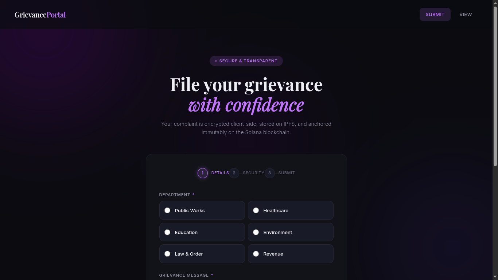
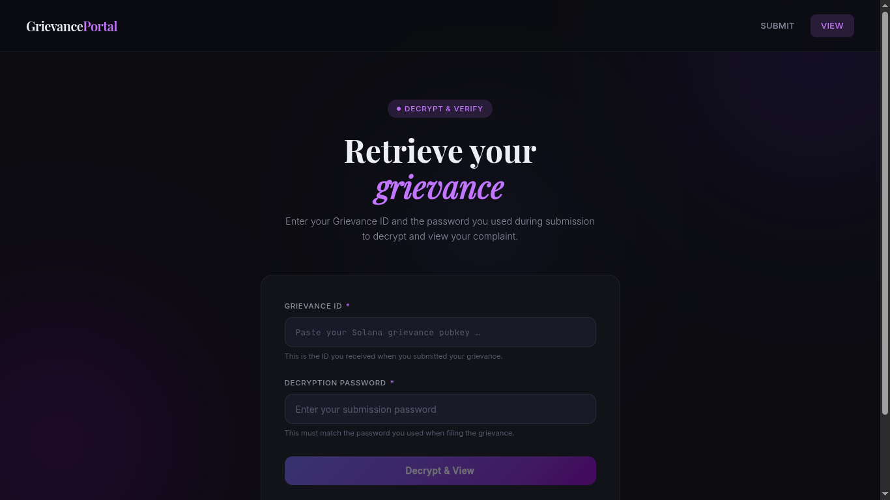

# GrievancePortal 🛡️  
**A Secure, Transparent, and Verifiable Grievance Redressal System using IPFS & Solana**

---

## Overview

**GrievancePortal** is a decentralized grievance redressal platform that allows users to submit complaints securely and transparently without relying on blind trust in centralized systems.

Grievances are:
- **Encrypted client-side**
- **Stored off-chain on IPFS**
- **Anchored immutably on the Solana blockchain**

This ensures **data integrity, tamper resistance, privacy, and public verifiability**, while keeping sensitive grievance content confidential.

---

## What Problem Does This Solve?

Traditional grievance systems suffer from:
- Lack of transparency
- Silent deletion or modification of complaints
- No verifiable audit trail
- Over-centralized control
- Low public trust

This project solves these by ensuring:
- Complaints cannot be altered or deleted once submitted
- Proof of submission exists permanently on-chain
- Data confidentiality is preserved via encryption
- Status updates are publicly verifiable

---

## Why This Didn’t Exist Before

- Government systems are largely centralized and opaque
- Blockchain adoption in civic tech is still early
- UX challenges slowed adoption for non-crypto users
- No clear incentive models for transparency-based governance

This project explores a **new application of decentralization for civic infrastructure**, rather than finance or NFTs.

---

## System Architecture (High Level)

1. User writes a grievance in the browser
2. Grievance is **encrypted in-transit**
3. Encrypted data is uploaded to **IPFS**
4. IPFS **CID + content hash** is stored on Solana
5. Status updates are added as **new on-chain events**
6. Anyone can verify integrity; only authorized parties can decrypt content

---

## Program Structure

```text
.
├── app.py                 # Backend API (FastAPI)
├── client.py              # Python client for interacting with Solana program
├── crypto_utils.py        # Encryption & hashing utilities
├── ipfs_utils.py          # IPFS upload & retrieval helpers
├── idl.json               # Anchor IDL for the Solana program
├── smart_contract.rs      # Solana smart contract (Anchor)
├── templates/             # Frontend HTML templates
├── wallet-keypair.json    # Devnet wallet (testing only)
├── requirements.txt       # Python dependencies
├── LICENSE
└── README.md

```
---

## What Data Is Stored Where?

### On IPFS (Encrypted JSON)
- Grievance message
- Department
- Category
- Timestamp
- Optional metadata

### On Solana Blockchain
- IPFS CID
- Message hash (for integrity verification)
- Department
- Creator public key
- Timestamp
- Status updates (Pending / InProgress / Resolved / Rejected)

> No sensitive grievance content is stored directly on-chain.

---

## Screenshots

### Grievance Submission Interface
<!-- Add Screenshot Here -->


### Grievance Retrieval Interface
<!-- Add Screenshot Here -->


---

## Is This a Proof of Concept?

Yes.  
This project is a **proof-of-work MVP** demonstrating:
- Secure grievance submission
- On-chain anchoring
- Verifiable integrity
- Privacy-preserving storage

It is intentionally minimal to validate feasibility within a hackathon timeframe.

---

## What Makes This Unique?

- First-of-its-kind **decentralized grievance anchoring system**
- Combines **encryption + IPFS + blockchain** meaningfully
- Does not expose sensitive data publicly
- Transparent yet privacy-preserving
- Applicable beyond government (corporates, universities, NGOs)

---

## Challenges Faced

- Steep learning curve for IPFS & Solana
- Writing a secure smart contract on Devnet
- Designing encryption flows without user friction
- Building usable UX for a blockchain-backed system
- Completing everything within a very short hackathon timeframe

---

## Future Work

- Replace symmetric encryption with **asymmetric encryption**
- Role-based admin dashboard for departments
- Automated email notifications on submission & status updates
- DAO or multi-sig based grievance resolution authority
- Production-grade key management
- Better UX for non-technical users

---

## Conclusion

GrievancePortal explores how **trust, transparency, and accountability** can be rebuilt using decentralized technologies.  
It is not meant to replace existing systems overnight—but to **prove that a better, verifiable alternative is possible**.

---

## License
Apache License
